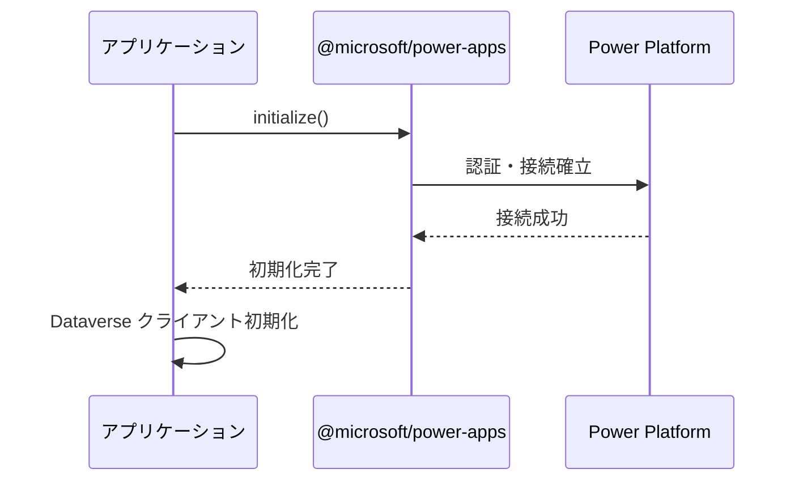
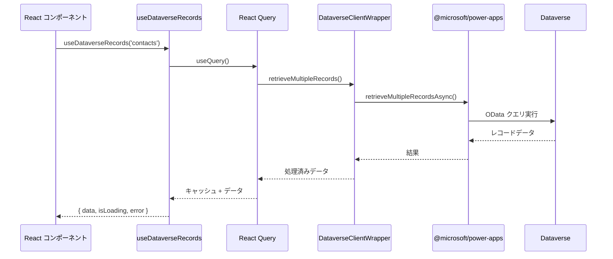
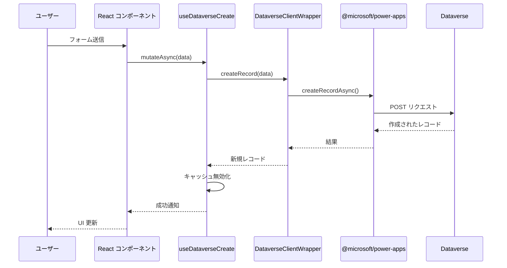

# Dataverse 接続方式 設計ドキュメント

## 概要

このドキュメントは、CodeAppsStarter における Dataverse 接続およびメタデータ取得の実装方針と設計について説明します。

従来の XML ベースの実装に代わり、Microsoft Learn で推奨される公式 API および `@microsoft/power-apps` SDK を使用した実装に刷新しました。

## 実装方針

### 1. 技術スタック

- **SDK**: `@microsoft/power-apps` (v0.3.21 以降)
- **言語**: TypeScript
- **データフェッチ**: React Query (@tanstack/react-query)
- **認証**: Power Platform 標準認証（pac CLI 経由）

### 2. 設計原則

1. **XML 非依存**: XML ファイルを使用せず、SDK の API を直接使用
2. **型安全性**: TypeScript による完全な型定義
3. **コマンド実行可能**: CLI ツールによる単独実行をサポート
4. **React 統合**: React Query による効率的なデータ管理
5. **Microsoft Learn 準拠**: 公式ドキュメントに従った実装

## アーキテクチャ

### コンポーネント構成

```
┌─────────────────────────────────────────────────────────┐
│                   アプリケーション層                      │
│  (React コンポーネント、ページ、UI)                       │
└───────────────────┬─────────────────────────────────────┘
                    │
┌───────────────────▼─────────────────────────────────────┐
│              React フック層 (use-dataverse.ts)          │
│  • useDataverseRecords (複数レコード取得)                │
│  • useDataverseRecord (単一レコード取得)                 │
│  • useDataverseCreate (レコード作成)                     │
│  • useDataverseUpdate (レコード更新)                     │
│  • useDataverseDelete (レコード削除)                     │
└───────────────────┬─────────────────────────────────────┘
                    │
┌───────────────────▼─────────────────────────────────────┐
│          クライアント層 (dataverse-client.ts)            │
│  • DataverseClientWrapper クラス                         │
│  • CRUD 操作のラッパー                                   │
│  • クエリオプションのビルダー                             │
└───────────────────┬─────────────────────────────────────┘
                    │
┌───────────────────▼─────────────────────────────────────┐
│       @microsoft/power-apps SDK                         │
│  • getClient() - クライアント取得                        │
│  • retrieveRecordAsync() - 単一レコード取得              │
│  • retrieveMultipleRecordsAsync() - 複数レコード取得     │
│  • createRecordAsync() - レコード作成                    │
│  • updateRecordAsync() - レコード更新                    │
│  • deleteRecordAsync() - レコード削除                    │
└───────────────────┬─────────────────────────────────────┘
                    │
┌───────────────────▼─────────────────────────────────────┐
│              Power Platform / Dataverse                 │
└─────────────────────────────────────────────────────────┘
```

### ファイル構成

```
src/
├── lib/
│   ├── dataverse-client.ts          # Dataverse クライアントラッパー
│   └── dataverse-metadata.ts        # メタデータ管理とヘルパー
├── hooks/
│   └── use-dataverse.ts             # React カスタムフック
scripts/
└── dataverse-cli.ts                 # CLI ツール
docs/
└── dataverse-design.md              # 本ドキュメント
```

## API 利用方針

### 1. 接続方法

#### 初期化

アプリケーション起動時に `@microsoft/power-apps/app` の `initialize()` を呼び出します：

```typescript
import { initialize } from '@microsoft/power-apps/app';

useEffect(() => {
  const init = async () => {
    await initialize();
  };
  init();
}, []);
```

#### クライアント取得

テーブルスキーマを定義し、クライアントを取得します：

```typescript
import { getClient } from '@microsoft/power-apps/data';

const schema = {
  contacts: {
    tableId: "guid-here",
    apis: {}
  }
};

const client = getClient(schema);
```

### 2. データ操作

#### 複数レコード取得

```typescript
const records = await client.retrieveMultipleRecordsAsync<Contact>(
  'contacts',
  '$select=fullname,emailaddress1&$top=10'
);
```

#### 単一レコード取得

```typescript
const record = await client.retrieveRecordAsync<Contact>(
  'contacts',
  contactId,
  '$select=fullname,emailaddress1'
);
```

#### レコード作成

```typescript
const newRecord = await client.createRecordAsync<Contact, Contact>(
  'contacts',
  { fullname: '山田 太郎', emailaddress1: 'yamada@example.com' }
);
```

#### レコード更新

```typescript
const updated = await client.updateRecordAsync<Contact, Contact>(
  'contacts',
  contactId,
  { emailaddress1: 'newemail@example.com' }
);
```

#### レコード削除

```typescript
await client.deleteRecordAsync('contacts', contactId);
```

### 3. メタデータ取得

現在の `@microsoft/power-apps` SDK では、直接的なメタデータ取得 API は提供されていません。
メタデータを取得する方法は以下の通りです：

#### 方法1: pac CLI によるコード生成（推奨）

```bash
pac code add-data-source -a dataverse -t <table-logical-name>
```

このコマンドにより、以下のファイルが生成されます：
- `generated/models/<TableName>Model.ts` - TypeScript 型定義
- `generated/services/<TableName>Service.ts` - サービスクラス

#### 方法2: Dataverse Web API 直接呼び出し

```typescript
// EntityDefinitions を取得
const response = await fetch(
  `${dataverseUrl}/api/data/v9.2/EntityDefinitions(LogicalName='contact')`,
  {
    headers: {
      'OData-MaxVersion': '4.0',
      'OData-Version': '4.0',
      'Accept': 'application/json'
    }
  }
);
const metadata = await response.json();
```

## 処理フロー

### 1. アプリケーション起動時



### 2. データ取得フロー



### 3. レコード作成フロー



## CLI ツール

### コマンド一覧

```bash
# ヘルプ表示
npm run dataverse:help

# 接続テスト
npm run dataverse:test

# テーブルメタデータ表示
npm run dataverse:metadata account

# pac CLI ガイド表示
npm run dataverse:guide contact

# サンプルテーブル一覧
npm run dataverse:list

# pac CLI コマンド生成
npm run dataverse:commands account
```

### 実装

CLI ツールは `scripts/dataverse-cli.ts` に実装されており、以下の機能を提供します：

1. **接続テスト**: `power.config.json` の検証
2. **メタデータ表示**: サンプルスキーマ情報の表示
3. **ガイド生成**: pac CLI 使用方法の表示
4. **コマンド生成**: 各テーブル用の pac CLI コマンド生成

## 使用例

### 基本的な使用例

```typescript
// 1. アプリケーション初期化（App.tsx など）
import { initialize } from '@microsoft/power-apps/app';
import { initializeDataverseClient } from '@/hooks/use-dataverse';

useEffect(() => {
  const init = async () => {
    await initialize();
    
    // Dataverse スキーマを定義
    const schema = {
      contacts: {
        tableId: "guid-here",
        apis: {}
      }
    };
    
    initializeDataverseClient(schema);
  };
  init();
}, []);

// 2. コンポーネントでデータを使用
import { useDataverseRecords } from '@/hooks/use-dataverse';

function ContactList() {
  const { data: contacts, isLoading, error } = useDataverseRecords<Contact>(
    'contacts',
    {
      select: ['fullname', 'emailaddress1'],
      orderBy: ['fullname'],
      top: 50
    }
  );

  if (isLoading) return <div>読み込み中...</div>;
  if (error) return <div>エラー: {error.message}</div>;

  return (
    <div>
      {contacts?.map(contact => (
        <div key={contact.contactid}>
          {contact.fullname} - {contact.emailaddress1}
        </div>
      ))}
    </div>
  );
}
```

### レコード作成の例

```typescript
import { useDataverseCreate } from '@/hooks/use-dataverse';

function CreateContactForm() {
  const createContact = useDataverseCreate<ContactInput, Contact>('contacts');

  const handleSubmit = async (data: ContactInput) => {
    try {
      const newContact = await createContact.mutateAsync(data);
      console.log('作成成功:', newContact);
      // 成功時の処理
    } catch (error) {
      console.error('作成失敗:', error);
      // エラーハンドリング
    }
  };

  return (
    <form onSubmit={handleSubmit}>
      {/* フォームフィールド */}
    </form>
  );
}
```

## セキュリティ考慮事項

### 1. 認証

- Power Platform の標準認証を使用
- pac CLI で事前に認証を完了しておく必要がある
- トークンは SDK が自動管理

### 2. データアクセス

- Dataverse のセキュリティロールに基づくアクセス制御
- 行レベル、列レベルのセキュリティが適用される
- 不正なアクセスは Dataverse 側で自動的にブロック

### 3. 環境管理

- `power.config.json` には環境 ID のみを含む
- 機密情報（クレデンシャル等）は含まない
- `.gitignore` で `power.config.json` を除外することを推奨

## 制限事項

### 現在の SDK の制限

1. **メタデータ API なし**: 
   - 直接的なメタデータ取得 API は提供されていない
   - pac CLI によるコード生成を使用する必要がある

2. **高度なクエリ**:
   - 複雑な FetchXML クエリは直接サポートされていない
   - OData クエリ文字列を使用する必要がある

3. **トランザクション**:
   - 複数操作のトランザクション処理は未サポート

### 回避策

- **メタデータ**: pac CLI でコード生成、または Dataverse Web API を直接使用
- **高度なクエリ**: Dataverse Web API のカスタムアクションを使用
- **トランザクション**: Dataverse のプラグインやカスタムアクションで実装

## 今後の拡張

1. **生成コードの統合**: pac CLI で生成されたモデル・サービスとの統合
2. **エラーハンドリング**: より詳細なエラー処理とリトライロジック
3. **オフライン対応**: ローカルキャッシュとオフライン同期
4. **バッチ操作**: 複数レコードの一括処理

## 参考資料

### Microsoft Learn

- [Dataverse への接続方法](https://learn.microsoft.com/ja-jp/power-apps/developer/code-apps/how-to/connect-to-dataverse)
- [テーブルメタデータの取得](https://learn.microsoft.com/ja-jp/power-apps/developer/code-apps/how-to/get-table-metadata)
- [Power Apps Code Apps 概要](https://github.com/microsoft/PowerAppsCodeApps)

### SDK ドキュメント

- [@microsoft/power-apps パッケージ](https://www.npmjs.com/package/@microsoft/power-apps)
- [IOrganizationService インターフェース](https://learn.microsoft.com/ja-jp/power-apps/developer/data-platform/org-service/iorganizationservice-interface)

### ブログ・記事

- [Dataverse as a Data Source in Power Apps Code Apps](https://nebulaaitsolutions.com/blog/how-to-add-dataverse-as-a-data-source-in-power-apps-code-apps)

## 変更履歴

- 2026-02-06: 初版作成 - XML ベースから API ベースへの刷新
